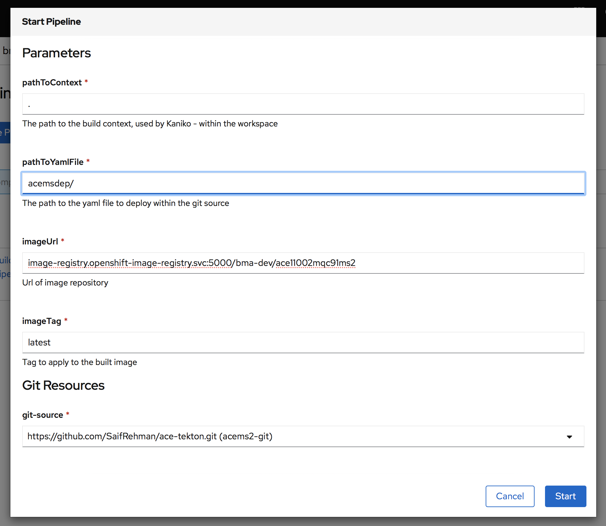

# Ace-Tekton
This documentation goes explain how you can use tekton to deploy ace microservice 


## Deploy Tekton artifacts

1. Create service account 
```
$ oc apply -f ace/tekton/account/pipeline-account.yaml
```

2.  Create Resources

```
$ oc apply -f ace/tekton/resource/pipeline-resouce.yaml
```

Here add the git repo where you have all the resources

3. Create tasks

* Create kubectl tasks

```
$ oc apply -f ace/tekton/task/deploy-using-kubectl-common.yaml
```

* Create kaniko build image task

```
$ oc apply -f ace/tekton/task/source-to-image-kaniko.yaml
```

> Please not namespaces in all config files. also rename tektonace string to name you want in acemsdep folder. then commit and push 

## Apply service account
1. Create service account, role, and rolebinding

```
$ oc apply -f sa/
```

## Run pipeline
1. Go to openshift dashboard, click select ur namespace where you have the pipeline configuration deployed 
2. Select pipeline, and create on create pipeline 




test